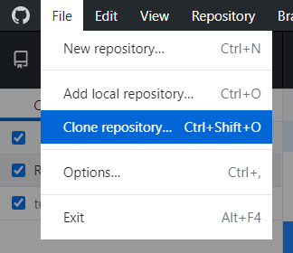
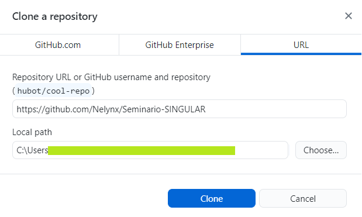
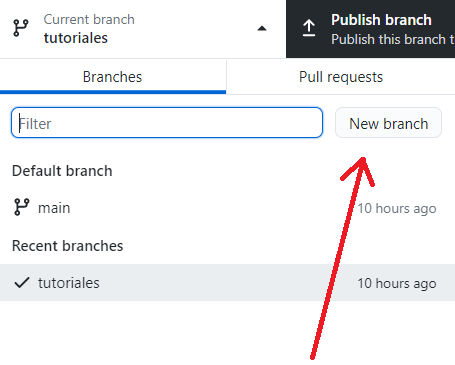
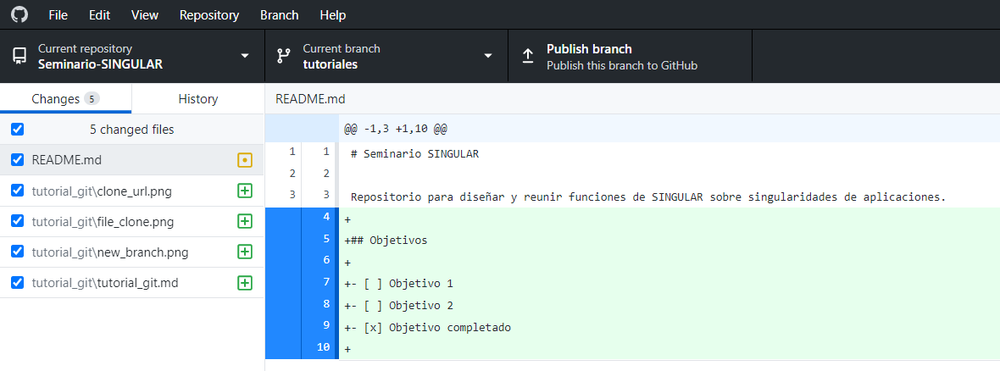
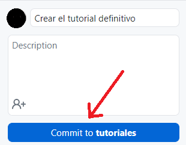
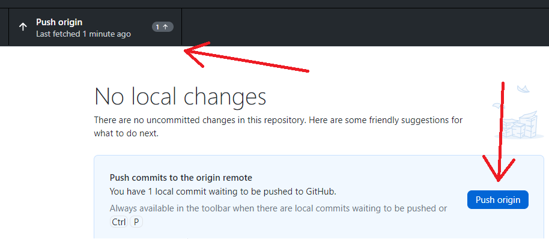

# Cómo usar github desktop
Git es un *sistema de control de versiones*, es decir, una herramienta que va registrando el desarrollo de los ficheros de texto de una carpeta, llamada **repositorio**.

La unidad mínima de git es el **commit** (entrega).
Hacer un commit es como guardar la partida: registra los cambios que hemos hecho desde el anterior commit.
Cada vez que le pedimos a git que haga un commit, lo que ocurre es lo siguiente:
  1. Git mira, linea a linea, de arriba a abajo, todos los archivos que hemos modificado.
  2. En cuanto encuentra una linea que no es **exactamente igual** que el anterior commit, registra una diferencia.
  3. Git guarda únicamente las diferencias, las empaqueta, les pone una etiqueta y las envuelve para regalo: un commit.

De esta forma, cuando git carga un repositorio, lo que hace es sumar todos los pequeños cambios, desde el vacío hasta la actualidad, generando el mismo repositorio.
Esto tiene la ventaja de que los repositorios son muy ligeros, aunque guarden **toda la historia** de cambios de un proyecto.

Los commits van en cadena, uno detrás de otro, a lo largo de **ramas** o **branches**. Desde un commit puedes crear una rama nueva, o fusionar (**merge**, o *mergear* en inglés macarrónico) dos ramas para, por ejemplo, juntar los cambios que han hecho dos persona.

Esto te permite, por ejemplo, tener una rama principal (**main**) con los cambios oficiales, e ir creando ramas secundarias para hacer pruebas y hacer evolucionar el proyecto, sin que la rama principal se vea afectada. Más adelante, cuando la rama ha avanzado y los cambios han sido probados y aprobados, se puede fusionar con la rama **main** y así el público puede disfrutar de nuestra maravillosa función nueva. O si hemos llegado a un punto muerto, la rama se puede quedar ahí para siempre sin que nadie lo sepa, y podemos volver a un commit anterior para tirar por otro sitio.

## Crear o clonar un proyecto

Lo primero que hace falta es tener un **repositorio** que no es más que una carpeta de toda la vida a la que le hemos enganchado git.

Podemos crear un repositorio en una carpeta que ya tengamos y que contenga nuestro proyecto, o podemos **clonar** uno que ya exista. 

Para clonar podemos indicarle la url del proyecto, y una carpeta que **debe estar vacía**:

## Crear una rama

Si queremos hacer cambios, lo ideal es hacerlos siempre en una rama nueva, porque así no interferimos con el trabajo que otros puedan estar haciendo.

Para ello simplemente:

---
**OJO:** ¡Revisa siempre la rama sobre la que estás antes de ponerte a trabajar!

---

## Añadir un commit

Una vez hayas revisado que estás en la rama correcta, ya puedes ponerte a escribir.

En cuanto guardes cualquier modificación, verás que en el github desktop aparecen muchos colorines:

A la izquierda tenemos los archivos que hemos modificado, junto con un símbolo:
 - Un + si el fichero no existía y lo hemos creado
 - Un punto amarillo si hemos hecho modificaciones
 - Un - rojo si hemos eliminado un archivo

Si hacemos clic en cualquier archivo, nos saldrá un resumen de todas las líneas que hemos modificado: en verde si hemos añadido algo, en rojo si hemos quitado algo.

No nos vamos a engañar, a veces git hace cosas raras que no entendemos (los mortales, seguro que hay gente pro que lo entiende).
Os dirá que habéis borrado 20 lineas y las habéis vuelto a poner exactamente igual solo porque en una linea habéis tocado un acento.
No os preocupéis demasiado, ¡lo bonito de los commits es que siempre (casi) se puede volver atrás para enmendar un error!

Cuando estemos contentos con nuestros cambios, **los guardamos haciendo un commit**:

Los commits van acompañados de una pequeña frase o comentario que explica qué se ha modificado, pero sin entrar en detalles demasiado técnicos.

Por ejemplo, estos comentarios no son muy útiles:
 - :x: "cosas arregladas"
 - :x: "he cambiado la letra h por la x porque me parece que lo hace más simple pero bueno ya me decís"
 - :x: "test"

Pero bueno, esto ya es más cuestión estética.

---
### ¿Cuándo hago un commit?
¡Hacer commits es gratis, hazlo con frecuencia!

No hay un mínimo de líneas para un commit, pero la mejor práctica es hacer commits cada pocos cambios, aunque sean cosas muy pequeñas. Más vale que sobren...

---

## Subir los cambios (Push)

Una vez tengas todos tus cambios, es hora de compartirlos!
Simplemente haz clic en: 

¡Y así tu rama ya está disponible para todo el mundo!
A menos que... surjan conflictos

## Resolver Conflictos

WIP

## Añadir los cambios a main: Pull Requests

WIP

## Resumen

En una sesión de trabajo deberías:

1. Revisa en que rama estás!!! 
    - Si no tienes una rama propia, créala, es gratis.
2. Si estás en tu rama, haz fetch para buscar modificaciones.
3. 